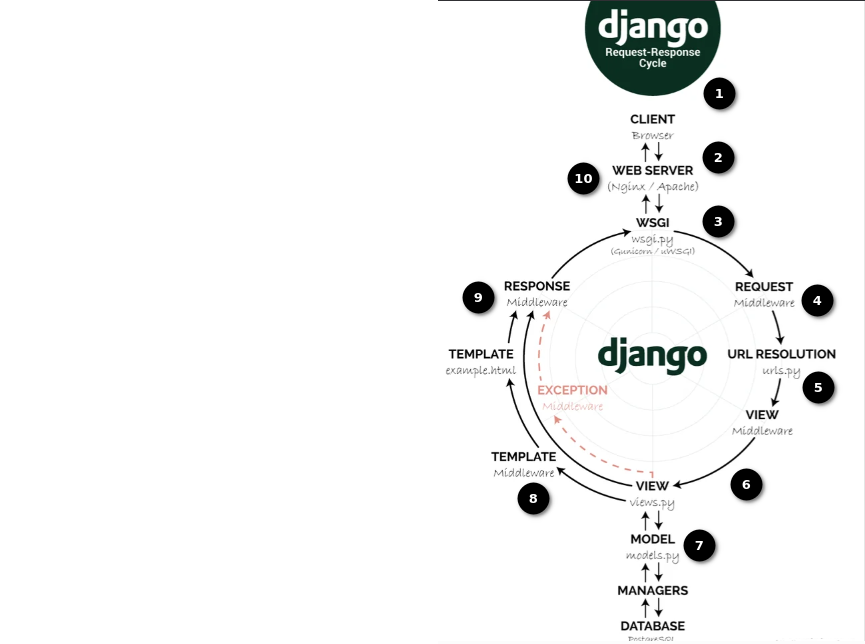

## 🌀 DJANGO REQUEST-RESPONSE CYCLE

Hola, en esta sección explicaré cómo Django procesa una solicitud paso a paso, hasta que se envía una respuesta. Vamos a entenderlo con ayuda de un ejemplo.

Para empezar debemos tener en cuenta que Django sigue la arquitectura MTV (Model-Template-View), que es muy parecida al tradicional MVC (Model-View-Controller):

- **Model:** Define la estructura de datos.
- **Template:** Controla la presentación (HTML).
- **View:** Lógica de negocio, conecta modelos con templates.

Tomaremos cómo ejemplo, el sitio que acabamos de crear.

### 📩 Paso 1: El usuario envía una petición (request)

El usuario abre el navegador y visita nuestro sitio:

https://bookswebsite.com/api/books/

El navegador envía una petición HTTP `GET` hacia nuestro servidor Django.


### 🛠️ Paso 2: El servidor WSGI recibe la petición

El **WSGI** (Web Server Gateway Interface) es como un puente entre el servidor (e.g., Gunicorn o uWSGI) y Django.

➡️ WSGI recibe la petición y la envía a Django para manejarla.

En nuestra aplicación, podemos encontrar el WSGI en el archivo `wsgi.py` dentro del directorio:

### ⚙️ Paso 3: Las configuraciones (`settings.py`) de Django se cargan

Django carga el archivo `settings.py`, el cual contiene todas las configuraciones del proyecto como:

- Aplicaciones instaladas
- Middlewares
- Configuración de URLs
- Configuración de la Base de Datos (`db.sqlite3`)
- Directorios de plantillas
- Ruta de archivos estáticos

### 🔐 Paso 4: El procesamiento del Middleware comienza

Django corre la petición a través de una cadena de **Middleware**. Por ejemplo:

- `SecurityMiddleware` verifica si es una petición segura
- `AuthenticationMiddleware` adjunta el usuario logueado a la petición
- `SessionMiddleware` adjunta los datos de la sesión

Podríamos pensar en el Middleware como:

Browser → Middleware1 → Midleware2 → Middleware3 → Views

Un guardían o filtro, en la puerta de un edificio, por la cual hay que pasar para llegar a ciertos lugares.

### 🔀 Paso 5: El enrutamiento de URLs ocurre (`urls.py`)

Django va al archivo `urls.py` para encontrar qué vista debe manejar la petición.

En nuestra aplicación, tenemos dos archivos `urls.py`:

📄 `Server/backend/backend/urls.py`:

```python
urlpatterns = [
    path('admin/', admin.site.urls),
    path('api/', include('crudapi.urls'))  # --> Aquí indicamos la ruta raíz
]
```

Sobre la ruta raíz, se van a ejecutar las rutas de nuestra API:

📄 `Server/backend/crudapi/urls.py`:

```python
urlpatterns = [
    path('books/', views.get_books, name = 'get_books'),
    path('books/create/', views.create_book, name = 'create_book'),
    path('books/<int:pk>', views.book_detail, name= 'book_detail')
]
```

### 🎯 Ahora Django sabe:

➡️ “Para esta petición `fetchBooks` (realizada en `/api/books/`), debería mostrar la vista `views.get_books`.”


### ⚡ Paso 6: Se llama a la función o clase `View`

Supongamos que al momento de declarar nuestra vista get_book, la hemos declarado un poco diferente a cómo lo hemos hecho en nuestro proyecto:

```python
def get_books(request):
    books = Book.objects.all()
    return render(request, 'books.html', {'books': books})
```

Al momento de llamar a esta función:
- Django obtiene los libros (books) de la base de datos.
- Luego renderiza los libros utilizando una plantilla HTML.
- Después envía el HTML de vuelta al usuario.

### 💡 Paso 7: Resultado de la Base de Datos (ORM query)

Si la vista accede a la base de datos (como `Book.objects.all()`), Django utiliza el **ORM** (Object Relational Mapper) para convertir código Python en una consulta SQL y obtener los datos.

Este es un ejemplo de la consulta SQL detrás de escena:

```sql
SELECT * FROM products;
```

### Paso 8: Renderizando plantilla (Generación del HTML)

La función `render()` combina:

- La plantilla HTML (por ejemplo: `books.html`)
- El contexto de datos (`{'books': [...]}`)

Y genera una página HTML como:

```html
<h1>All Books</h1>
<ul>
  <li>Title: You Don’t Know JS: Scope & Closures - autor: Kyle Simpson - release_year: 2014</li>
  <li>Title: Eloquent JavaScript (3ª edición) - autor: Marijn Haverbeke - release_year: 2018</li>
</ul>
```

### Paso 9: La respuesta vuelve a través del middleware (en orden inverso)

Antes de que al HTML se envie de vuelta al navegador, la respuesta pasa a través de todo middleware de nuevo, (pero en sentido inverso)

Esto permite el registro de modificaciones de respuesta, inicio de sesión, etc.

Views → Middleware3 → Middleware2 → Middleware1 → Browser

### ✅ Paso 10: El usuario ve la página final
La respuesta alcanza el navegador del usuario, y ve todos los libros:

```txt
All Books
Title: You Don’t Know JS: Scope & Closures - autor: Kyle Simpson - release_year: 2014
Title: Eloquent JavaScript (3ª edición) - autor: Marijn Haverbeke - release_year: 2018
```

#---------------------------

Este es un ciclo completo de solicitud-respuesta de Django en el mundo real.

``` html

```

### 🧩 Descripción resumida de los pasos:

1. El usuario envia una solicitud HTTP a https://bookswebsite.com/api/books/
2. WSGI reenvia la solicitud a Django
3. Django carga las configuraciones
4. El Middleware filtra la solicitud
5. Las URL enruta las coincidencias: api/books/,hacia la vista get_books
6. La vista ejecuta la lógica, consulta a la Base de Datos
7. El ORM btiene los datos
8. Se renderiza la plantilla HTML
9. La respuesta pasa de vuelta a través del Middleware
10. El usuario ve el resultado en el navegador

### 🎓 Bonus: Tip para entrevista

> 🗨️ Si te preguntan:
> **¿Puedes explicar el ciclo de solicitud de Django?**
>
> Puedes responder:
> *Sí. Cuando un usuario envía una solicitud, esta es procesada por el servidor WSGI. Django carga sus configuraciones, pasa la solicitud por los middleware, y luego enruta la URL hacia una vista. Esta vista puede consultar la base de datos con el ORM y renderiza una plantilla. Finalmente, la respuesta pasa nuevamente por los middleware y es devuelta al navegador del usuario.*
